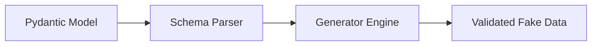

# Pyfake
<!-- # Getting Started -->

<p align="center">
  <a href="https://github.com/Mukhopadhyay/pyfake"></a>
</p>

<p align="center">
<i>A Flexible and Extensible fake data generator based on <strong>Pydantic</strong> models.</i>
</p>

<p align="center">
<a href="https://pypi.org/project/pyfake/" target="_blank">
</a>  
</p>

---

<p align="center">
  <b>Docs</b>: pyfake.readthedocs.io/en/latest &nbsp;•&nbsp;
  <b>Source</b>: github.com/Mukhopadhyay/pyfake
</p>

---

## ✨ Why Pyfake?

Most fake data generators are either:

❌ Random but not structured  
❌ Structured but not realistic  
❌ Hard to extend  

**Pyfake fixes that.**

It leverages **Pydantic models** as the single source of truth to generate:

- [x] Validated data  
- [x] Schema-aware fake data  
- [x] Easily extensible generators  
- [x] Strong typing + IDE autocomplete  

---

## Quick Example

```python
from pyfake import Pyfake
from pydantic import BaseModel, Field
from typing import Annotated, Union


class SubModel(BaseModel):
    sub_integer: int
    sub_string: str


class Model(BaseModel):
    integer_field: Annotated[int | None, Field(ge=0, le=100)]
    string_field: Annotated[str, Field(min_length=5, max_length=10, pattern=r"^[a-zA-Z]+$")]
    multi_type_field: Union[Annotated[int, Field(ge=0, le=100)], Annotated[str, Field(min_length=3, max_length=15)]]
    sub_model: SubModel


users = Pyfake.from_schema(User, num=5)

print(users)
```

<!-- termynal -->
```console
$ python example.py

{
  'integer_field': None,
  'string_field': 'kEwkDX',
  'multi_type_field': 'rTCtez',
  'sub_model': {
    'sub_integer': 34,
    'sub_string': 'WuUoAyokHe'
  }
}
```

## Installation

=== "uv (Recommended)" 

    ```bash
    uv add pyfake
    ```

=== "pip"


    ```bash
    python -m venv .venv
    source .venv/bin/activate
    pip install pyfake
    ```

!!! note "From source"
    **pyfake** can be downloaded directly from github as well

## How It Works

Pyfake reads your Pydantic schema and:

* Inspects field types and constraints
* Applies intelligent generators
* Produces validated fake data




