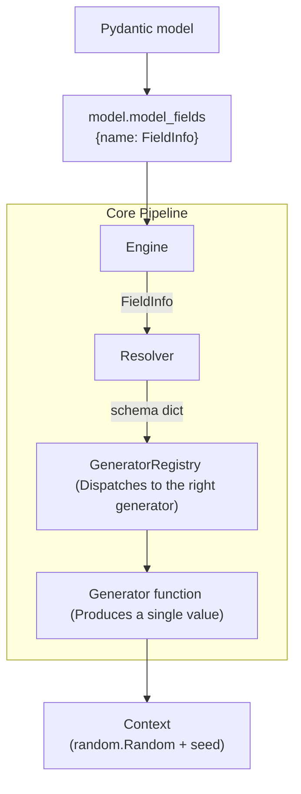

# Internals

This page documents the internal architecture of `pyfake` — how the pieces fit together and what responsibilities each component holds.

For a narrative walkthrough of a single generation call, see [How It Works](how-it-works.md).

---

## Architecture Overview

<!-- ```
Pydantic model
      │
      │  model.model_fields  →  {name: FieldInfo}
      ▼
   Engine          — iterates fields, collects results
      │
      │  FieldInfo  →  Resolver
      ▼
   Resolver        — converts annotation + constraints → schema dict
      │
      │  schema dict  →  GeneratorRegistry
      ▼
   GeneratorRegistry  — dispatches to the right generator
      │
      ▼
   Generator function  — produces a single value
      │
      ▼
   Context         — shared random.Random (and optional seed)
``` -->

<center>

</center>

---

## `Context`

```python
class Context:
    def __init__(self, seed: Optional[int] = None):
        self.random = random.Random(seed)
```

`Context` is the only place where randomness lives. Every generator receives it and uses `context.random` exclusively, so the entire generation run is controlled by a single source of entropy. Passing a `seed` makes output fully deterministic.

---

## `Resolver`

`Resolver` takes a `FieldInfo` and returns a schema dict. It works by recursively inspecting the annotation using `typing.get_origin` and `typing.get_args`, handling each structural form before bottoming out at a primitive type.

### Constraint extraction

Field constraints come from two places:

- **`FieldInfo` metadata** (e.g. `Field(ge=0, lt=100)`) — parsed at the root level.
- **`Annotated` metadata** (e.g. `Annotated[int, Field(min_length=3)]`) — parsed and merged as the recursion descends.

Both are collected into a `GeneratorArgs` instance. When the resolved node is a `union`, the constraints are pushed into each variant rather than the union wrapper itself.

### `GeneratorArgs` fields

| Field            | Applies to                            | Description                                 |
| ---------------- | ------------------------------------- | ------------------------------------------- |
| `lt`             | `int`, `float`                        | exclusive upper bound                       |
| `gt`             | `int`, `float`                        | exclusive lower bound                       |
| `le`             | `int`, `float`                        | inclusive upper bound                       |
| `ge`             | `int`, `float`                        | inclusive lower bound                       |
| `min_length`     | `str`, `list`, `set`, `tuple`, `dict` | minimum length                              |
| `max_length`     | `str`, `list`, `set`, `tuple`, `dict` | maximum length                              |
| `multiple_of`    | `float`                               | value must be a multiple                    |
| `decimal_places` | `float`                               | round to N decimal places                   |
| `pattern`        | `str`                                 | regex pattern (reserved, not yet enforced)  |
| `format`         | `str`, UUID                           | format key, e.g. `"uuid4"`, `"date-time"`   |
| `default`        | any                                   | return this value directly, skip generation |
| `examples`       | any                                   | reserved; not used by generators            |

---

## `GeneratorRegistry`

The registry owns the mapping from type keys and format strings to generator callables. It also contains the dispatch logic in `_generate(schema)`.

### Type and format map

```python
_generators = {
    "integer":   generate_int,
    "number":    generate_float,
    "string":    generate_str,
    "bool":      generate_bool,
    "uuid":      generate_uuid4,
    "uuid1":     generate_uuid1,
    # … uuid3 through uuid8
    "date":      generate_date,
    "date-time": generate_datetime,
    "time":      generate_time,
}

_type_map = {
    int:       "integer",
    float:     "number",
    str:       "string",
    bool:      "bool",
    uuid.UUID: "uuid",
}
```

### Dispatch order

`_generate` checks in this order and returns at the first match:

1. `generator_args.default is not None` → return the default directly.
2. `type == "union"` → randomly pick a variant; ~20% chance to return `None` for nullable unions.
3. `type == "literal"` → `random.choice(values)`.
4. `type == "enum"` → `random.choice(values)`.
5. `type in (list, set, dict, tuple)` → generate the correct number of items by recursing.
6. `type == "model"` → recurse into `fields` and construct the nested Pydantic model.
7. `generator_args.format` is set and matches a key in `_generators` → call that generator.
8. `type` is in `_type_map` → call the mapped generator.
9. Fall through → return `None`.

---

## `Engine`

`Engine` is intentionally thin. It iterates `model.model_fields`, calls `registry.generate(field_info)` for each one, and assembles the result dict. The dict is returned to `Pyfake`, which uses it to construct a validated model instance.

---

## `Pyfake`

`Pyfake` is the public surface. It wires together `Context`, `Engine`, and the model class, and handles the `num` / `as_dict` output options.

```python
# Functional (class method)
Pyfake.from_schema(MyModel, num=10, seed=0, as_dict=True)

# Object (useful when generating repeatedly from the same model)
fake = Pyfake(MyModel, seed=0)
fake.generate(num=5)
fake.generate(num=5)  # same seed → different values (stream continues)
```

!!! note
   Each `Pyfake` instance maintains its own `Context`. The random stream advances with each call to `generate`, so successive calls on the same instance produce different (but still deterministic) results.
