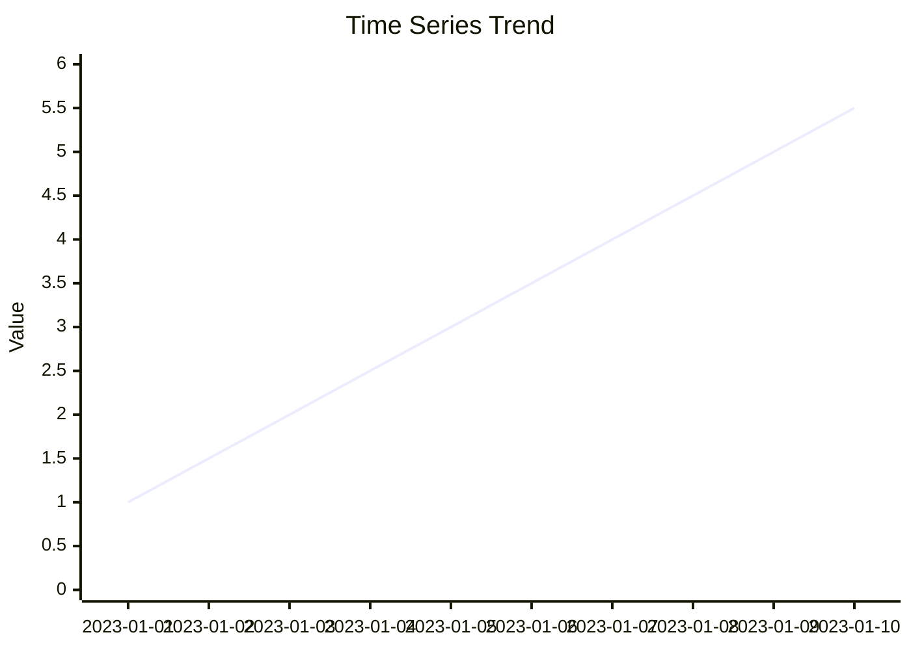

# Timeseries

This page shows how to use the `Timeseries` helper included in the `pyfake` package. It focuses on the concrete, tested behaviour you can rely on today (baseline + linear trend), and highlights current limitations so you don't get unexpected results.



!!! note
    The implementation is deliberately small and matches the behaviour exercised by the test-suite. Features mentioned in the source (seasonality, noise, anomalies, missing data) are scaffolded but not implemented yet; see [pyfake/core/timeseries.py](pyfake/core/timeseries.py) for details.

## Quick overview

- **What it does:** generates a simple synthetic time series as a list of `(datetime, value)` pairs.
- **What it currently supports:** baseline value, linear trend, deterministic timestamps and a reproducibility `seed` hook for future noise.
- **What it does not (yet) do:** add noise, seasonality, anomalies or missing values.

## API (practical)

- **`Timeseries`**: constructor arguments and behaviour
  - `start` (str|`datetime`): start timestamp. ISO-8601 string like "2023-01-01" is accepted.
  - `periods` (int): number of periods/points to generate.
  - `freq` (one of "minute", "hour", "day", "week", "month"): spacing between points. Note: "month" is implemented as 30 days.
  - `trend` ("upward"|"downward"|"flat" or dict): short-hand string chooses default small slope; passing a dict `{"type": <...>, "slope": <float>}` applies that slope per period.
  - `baseline` (float): starting value (default `100.0` in tests/examples).
  - `seed` (int|None): sets NumPy RNG seed internally (useful once noise is added).

- **`generate()`**: returns `List[Tuple[datetime, float]]` in chronological order.

## Behaviour illustrated (examples from tests)

=== "Python"

    ```python
    from pyfake import Timeseries

    # simple instantiation from ISO date string
    ts = Timeseries(start="2023-01-01", periods=10, freq="day", baseline=100.0)
    data = ts.generate()
    print(type(data), len(data))          # -> list, 10
    print(data[0])                       # -> (datetime(2023-01-01...), 100.0)

    # explicit trend with a dictionary (5 units per period upward)
    ts2 = Timeseries(start="2023-01-01", periods=3, freq="day", baseline=100.0,
                     trend={"type":"upward", "slope": 5})
    print([v for _, v in ts2.generate()])
    # -> [100.0, 105.0, 110.0]
    ```

=== "Notes"

The tests exercise the following concrete expectations which you can rely on:

- When `trend` is a string: "upward" → slope `0.1`, "downward" → slope `-0.1`, "flat" → slope `0`.
- When `trend` is a dict: `slope` is applied per period; `type` determines sign ("upward" → positive, "downward" → negative, "flat" → zero).
- If `trend` is `None` the constructor currently treats that as the default "upward" behaviour (slope `0.1`).

## Reproducibility and `seed`

The class calls `np.random.seed(seed)` when `seed` is provided. At the moment the generator does not add any random noise, so identical inputs already produce identical outputs. The `seed` parameter is retained and will make noise reproducible once noise-generation is enabled.

## Console demo (termynal)

Use this to quickly see the first few points from your shell. The snippet below mirrors the simple test cases.

```termynal
$ python - <<'PY'
> from pyfake import Timeseries
> ts = Timeseries(start="2023-01-01", periods=3, freq="day", baseline=100.0, trend=None)
> for t, v in ts.generate():
>     print(t.isoformat(), v)
> PY
```

## Frequency mapping and gotchas

- `minute`, `hour`, `day`, `week` map to natural timedelta values.
- `month` is implemented as a fixed 30-day interval (not calendar-aware).

!!! warning
    If you need calendar-accurate month boundaries (e.g. Feb, varying month lengths), convert the generated timestamps with a calendar-aware library — the builtin `month` behaviour is a 30-day approximation.

## Minimal test-driven examples (mirror assertions in tests)

```python
from pyfake import Timeseries

# 1) default small upward trend
ts = Timeseries(start="2023-01-01", baseline=100.0, periods=3, freq="day", trend=None)
assert ts.generate()[0][1] == 100.0
assert ts.generate()[1][1] == 100.1

# 2) explicit upward slope of 5 per period
ts = Timeseries(start="2023-01-01", baseline=100.0, periods=3, freq="day",
                trend={"type": "upward", "slope": 5})
data = ts.generate()
assert data[1][1] == 105.0
assert data[2][1] == 110.0

# 3) explicit downward slope
ts = Timeseries(start="2023-01-01", baseline=100.0, periods=3, freq="day",
                trend={"type": "downward", "slope": 3})
data = ts.generate()
assert data[1][1] == 97.0
assert data[2][1] == 94.0
```

## Limitations & next steps

- No noise/seasonality/anomaly injection yet — the source contains commented placeholders (`_apply_seasonality`, `_apply_noise`, `_inject_anomalies`, `_inject_missing`).
- Consider adding calendar-aware frequency handling, configurable noise models, and unit tests for those features.

